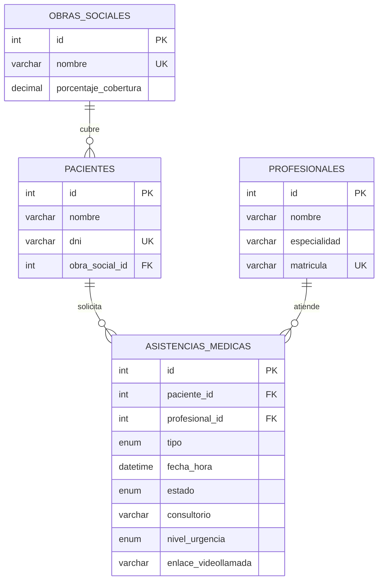

# Diagrama Entidad-Relacion

```mermaid
erDiagram
    OBRAS_SOCIALES ||--o{ PACIENTES : cubre
    PACIENTES ||--o{ ASISTENCIAS_MEDICAS : solicita
    PROFESIONALES ||--o{ ASISTENCIAS_MEDICAS : atiende

    OBRAS_SOCIALES {
        int id PK
        varchar nombre UK
        decimal porcentaje_cobertura
    }

    PACIENTES {
        int id PK
        varchar nombre
        varchar dni UK
        int obra_social_id FK
    }

    PROFESIONALES {
        int id PK
        varchar nombre
        varchar especialidad
        varchar matricula UK
    }

    ASISTENCIAS_MEDICAS {
        int id PK
        int paciente_id FK
        int profesional_id FK
        enum tipo
        datetime fecha_hora
        enum estado
        varchar consultorio
        enum nivel_urgencia
        varchar enlace_videollamada
    }
```
