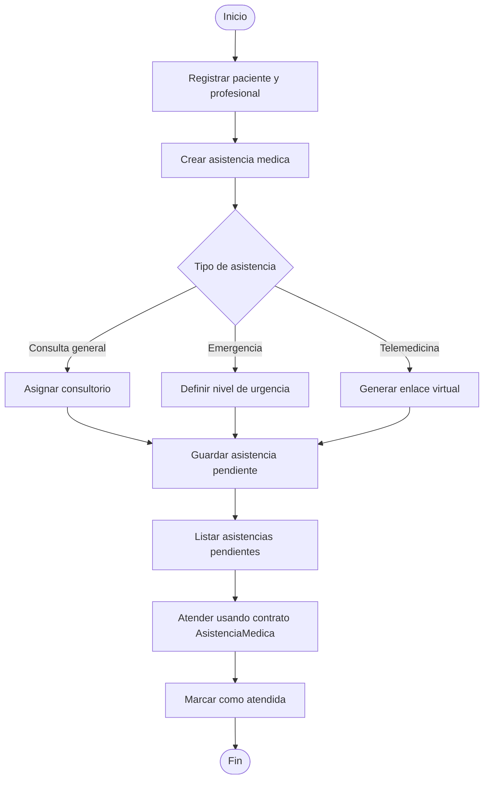

# Diagrama de Flujo

```mermaid
flowchart TD
    A([Inicio]) --> B[Registrar paciente y profesional]
    B --> C[Crear asistencia medica]
    C --> D{Tipo de asistencia}
    D -->|Consulta general| E[Asignar consultorio]
    D -->|Emergencia| F[Definir nivel de urgencia]
    D -->|Telemedicina| G[Generar enlace virtual]
    E --> H[Guardar asistencia pendiente]
    F --> H
    G --> H
    H --> I[Listar asistencias pendientes]
    I --> J[Atender usando contrato AsistenciaMedica]
    J --> K[Marcar como atendida]
    K --> L([Fin])
```
